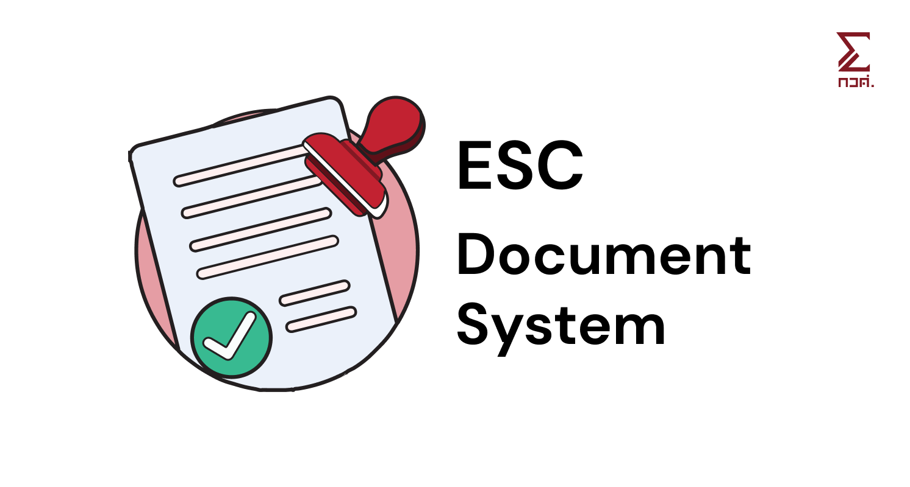

# ESC Project Tracker

Document generator tool to facilitate internal document process in ESC organization (especially for secretary).



## Features

- [x] Generate document from template
- [x] Generate document from .toml file
- [ ] Fetch data from a database

## Document Types

- [x] (1) Location Permit
- [ ] (0) Project Proposal
- [ ] (3) Sponsorship Request
- [ ] (6) Event Report
- [ ] (7) Financial Report
- [ ] (8) Money Request
- [ ] (AT) Attendance List

## Setup

Make sure you have [Node.js](https://nodejs.org/en/) and [pnpm](https://pnpm.io/) installed.

1. Clone this repository

```bash
git clone https://github.com/esc-chula/esc-project-tracker.git
```

2. Install dependencies

```bash
pnpm install
```

3. Create .env and paste the env in /api and /web folder

4. Create database (Migration will automatically be done when the app start up. (TypeORM `synchronize: true`))

```bash
docker run -d --name postgres-admin -e POSTGRES_USER=admin -e POSTGRES_PASSWORD='AdminPass123!' -e POSTGRES_DB=admin_db -p 5432:5432 -v postgres_data:/var/lib/postgresql/data postgres:17
```

5. Run the app at /api for backend, /web for frontend, or root for both at the same time
   _make sure that you are not connected to ChulaWiFi_

```bash
turbo dev
```

### Development mode

For local development without Intania Auth, set these variables in **ALL THREE ENV FILES**

```env
DEV_MODE=true
DEV_MODE_ROLE=admin # Options: admin | esc | student
JWT_SECRET=secret
```

When you're in this mode, Intania Auth is bypassed. Real JWT are generated, but no data is stored in DB.

Logging out have not been implemented yet for mock auth.

## Test

1. Run this command at /api for backend, /web for frontend, or root for both at the same time

```bash
turbo build
```

2. If built successfully, re-install dependencies at root folder

```bash
pnpm install --force
```

## Troubleshooting

### `@repo/shared` module not found

If your IDE give you red squiggly line on `import ... from '@repo/shared';`:

**Solution:**

Run this command at the repo root.

```bash
cd packages/shared
pnpm build
```

Alternatively, rebuild all packages.

```
turbo build
```